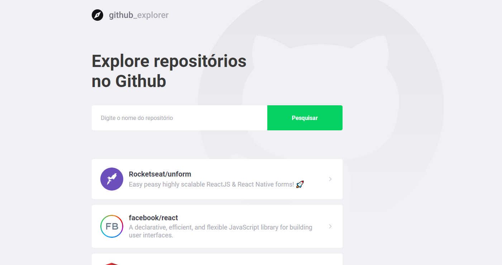

# Estrutura e padrões ✔

Nessa etapa daremos início ao aprendizado do ReactJS, criando o primeiro projeto já utilizando TypeScript. Nesse ponto o dev já deve conhecer os conceitos de componente, estado e propriedades mas eles serão lembrados durante as aulas.

<p align="center">
  
</p>

# 2. Criando a aplicação

## 2.1 Criando as Rotas


1. Instalar o react router dom

   ```
   yarn add react-router-dom
   yarn add @types/react-router-dom -D
   ```

2. Criar a pasta de rotas na raiz 'routes'

3. Criar o arquivo index.tsx dentro de routes

   ```javascript
   import React from 'react';
   
   import { Switch, Route } from 'react-router-dom';
   
   import Dashboard from '../pages/Dashboard';
   
   import Repository from '../pages/Repository';
   
   const Routes: React.FC = () => (
     <Switch>
       <Route path="/" exact component={Dashboard} />
       <Route path="/repository" component={Repository} />
     </Switch>
   );
   
   export default Routes;
   
   /**
    * o Switch faz com que apenas uma rota seja exibida
    *
    *   <Switch>
       <Route path="/" exact component={Dashboard} />
       <Route path="/repository" component={Repository} />
     </Switch>
   );
   
    */
   
   ```

4. Criar a pasta pages

5. Criar uma pasta para cada rota com o arquivo index.tsx:

6. Exemplo Dashboard/index.tsx

   ```javascript
   import React from 'react';
   
   // const Dashboard = () => {}
   // igual a
   // funcution Dashboard() {}
   // React.FC -> Function Component
   
   const Dashboard: React.FC = () => {
     return <h1>Dashboard</h1>;
   };
   
   export default Dashboard;
   
   ```

7. Exemplo Repository/index.ts

   ```typescript
   import React from 'react';
   import { useRouteMatch } from 'react-router-dom';
   
   const Repository: React.FC = () => {
     return <h1>Repository</h1>;
   };
   
   export default Repository;
   
   ```
   
   
   
8. Carregar o componente de rotas (routes/index.tsx) no arquivo do App.tsx

   ```javascript
   import React from 'react';
   
   import { Title } from './styles';
   
   // const Dashboard = () => {}
   // igual a
   // funcution Dashboard() {}
   // React.FC -> Function Component
   
   const Dashboard: React.FC = () => {
     return <Title>Explore repositórios no Github</Title>;
   };
   
   export default Dashboard;
   
   ```

## 2.2 Utilizando Styled Components

1. Instalar o componente styled

   ```javascript
   yarn add styled-components
   yarn add @types/styled-components -D
   ```

2. Instalar a extensão vscode-styled-components

3. Usar Template literals com `` para passar os estilos > styles.ts

   ```javascript
   import styled from 'styled-components';
   
   // Template literals ``
   export const Title = styled.h1`
     font-size: 48px;
     color: #3a3a3a;
   `;
   
   ```

4. STYLED-COMPONENTS DO REACT: permite aplicar estilos com escopo (somente onde queremos e não globalmente ou globalmente). Server para o REACT.js e o REACT Native (web e mobile).

5. Para estilos globais criar uma pasta styles na raiz e um arquivo chamado global.ts

   ```
   import { createGlobalStyle } from 'styled-components';
   
   import githubBackground from '../assets/github-background.svg';
   
   export default createGlobalStyle`
   * {
     margin:0;
     padding:0;
     outline:0;
     box-sizing:border-box;
   }
   
   body {
     background: #F0F0F5 url(${githubBackground}) no-repeat 70% top;
     -webkit-font-smoothing: antialiased;
   }
   
   body, input, button {
     font: 16px Roboto, sans-serif;
   }
   
   #root {
     max-width: 960px;
     margin: 0 auto;
     padding: 40px 20px;
   }
   
   button {
     cursor: pointer;
   }
   `;
   
   ```

   

## 2.3 Estilizando Dashboard


1. Continuar a formatação do html e do css

2. Instalar o pacote polished para escurecer ou clarear os estilos

   ```powershell
   yarn add polished
   ```

   ```javascript
   import { shade } from 'polished';
   ```

3.  Instalar o pacote react-icons para inserir ícones na aplicação;

   ```
   yarn add react-icons
   ```

   ```
   import { FiChevronRight } from 'react-icons/fi';
   ```

4. Para adicionar uma codificação ao elemento pode-se utilizar o & comercial nos estilos

5. Para adicionar uma codificação que se repete a cada elemento pode-se utilizar o "elemento + o elemento", como no exemplo abaixo:

   ```
   a + a {
         margin-top: 16px;
       }
   ```

6. Ou dentro do elemento utiliza-se o & comercial:

   ```
    & + a {
         margin-top: 16px;
       }
   ```

## 2.4 Conectando a API

1. Criar uma pasta chamada services com o arquivo api.ts:

   ```
   import axios from 'axios';
   
   const api = axios.create({
     baseURL: 'https://api.github.com',
   });
   
   export default api;
   
   ```

2. Importar a api.ts no arquivo arquivo da página Dashboard:

   ```
   import api from '../../services/api';
   ```

3. Retornar os dados da api na aplicação utilizando o useState:

   ```
   import React, { useState, useEffect, FormEvent } from 'react';
   ...
   ```

4. Criar uma interface para repassar a typagem somente dos dados que serão exibidos em tela:

   ```
   interface Repository {
     full_name: string;
     description: string;
     owner: {
       login: string;
       avatar_url: string;
     };
   }
   ```

5. Criar uma variável vazia para receber os dados da api.

   ```
   const [repositories, setRepositories] = useState<Repository[]>([]);
   ```

6. Criar uma função para popular os elementos com os dados da api:

   ```javascript
     async function handleAddRepository(
       event: FormEvent<HTMLFormElement>,
     ): Promise<void> {
       event.preventDefault();
       
         const response = await api.get<Repository>(`repos/${newRepo}`);
         // console.log(response);
   
         const repository = response.data;
   
         setRepositories([...repositories, repository]);
         setNewRepo('');
         setInputError('');
      }
   ```

7. Repassar o conteúdo para os elementos através do map

   ```javascript
   return (
       <>
         
         <Title>Explore repositórios no Github</Title>
   
         <Form onSubmit={handleAddRepository}>
           <input
             value={newRepo}
             onChange={e => setNewRepo(e.target.value)}
             placeholder="Digite o nome do repositório"
           />
           <button type="submit">Pesquisar</button>
         </Form>
   
         <Repositories>
           {repositories.map(repository => (
             <a key={repository.full_name} href="cool">
               
               <div>
                 <strong>{repository.full_name}</strong>
                 <p>{repository.description}</p>
               </div>
               <FiChevronRight size={20} />
             </a>
           ))}
         </Repositories>
       </>
     );
   ```

   

## 2.5 Lidando com erros

1. Receber o erro caso o formulário seja enviado vazio:

   ```
       if (!newRepo) {
         setInputError('Digite o autor/nome do repositório');
         return;
       }
   ```

2. Receber o erro da api caso o repositório não exista e criar um erro específico, através do try {  } catch (err) {  }

   ```javascript
     try {
         const response = await api.get<Repository>(`repos/${newRepo}`);
         // console.log(response);
   
         const repository = response.data;
   
         setRepositories([...repositories, repository]);
         setNewRepo('');
         setInputError('');
       } catch (err) {
         setInputError('Erro na Busca por esse repositório');
       }
   ```

3. Criar um novo elemento abaixo do form para receber o conteúdo do erro:

   ```javascript
    {inputError && <Error>{inputError}</Error>}
         {/* Só exibe o inpuError se ele existir */}
   ```

4. Criar o estilo do elemento em styles.ts

   ```javascript
   export const Error = styled.span`
     display: block;
     color: #c53030;
     margin-top: 8px;
   `;
   ```

   

5. Adicionar ao elemento input e o form cores específicas de erro no styles.ts:

   ```typescript
   export const Form = styled.form<FormProps>`
     margin-top: 40px;
     max-width: 700px;
   
     display: flex;
   
     input {
       flex: 1;
       height: 70px;
       padding: 0 24px;
       border: 0;
       border-radius: 5px 0 0 5px;
       color: #3a3a3a;
       border: 2px solid #fff;
       border-right: 0;
   
       ${props =>
         props.hasError &&
         css`
           border-color: #c53030;
         `}
   
       &::placeholder {
         color: #a8a8b3;
       }
     }
   ```

   

6. No elemento do form acrescentar o parâmetro para alterar o estilo quando houver erro:

   ```javascript
   <Form hasError={!!inputError} onSubmit={handleAddRepository}>
   ```

   

## 2.6 Salvando no Storage

1. Utilizar a função useEffect para salvar o conteúdo do array do repositories no local storage

   ```typescript
   // Salvar os dados do repositórios no local storage
     useEffect(() => {
       localStorage.setItem(
         '@GithubExplorer:repositories',
         JSON.stringify(repositories),
       );
     }, [repositories]);
   ```

2. Preencher a constante do array repositores, que iniciava um array vazio, com a busca do local storage

   ```typescript
   	// const [repositories, setRepositories] = useState<Repository[]>([]);
   	const [repositories, setRepositories] = useState<Repository[]>(() => {
       const storagedRepositories = localStorage.getItem(
         '@GithubExplorer:repositories',
       );
   
       if (storagedRepositories) {
         return JSON.parse(storagedRepositories);
       }
       return [];
     });
   ```

   

## 2.7 Navegando entre rotas

1. Importar o componente Link de react-router-dom e substituir o elemento <a   para <Link - Assim será permitido navegar entre rotas de recarregar a página inteira. E também substituir o 'href' por 'to' . Inserir no to o caminho da nova rota > to="/repository"

   ```typescript
   import { Link } from 'react-router-dom';
   
   // ...
   
   <Repositories>
           {repositories.map(repository => (
             <Link
               key={repository.full_name}
               to={`/repositories/${repository.full_name}`}
             >
               
               <div>
                 <strong>{repository.full_name}</strong>
                 <p>{repository.description}</p>
               </div>
               <FiChevronRight size={20} />
             </Link>
           ))}
         </Repositories>
   ```

2. Na rota da aplicação alterar a rota para receber um parâmetro precedido de barra através do "+" ao final que irá adicionar quaisquer dados que venham depois, assim não serão confundidos como uma nova rota.

   ```
   <Route path="/repositories/:repository+" component={Repository} />
   ```

3. Agora na pasta/rota Repository/index.tsx, importar o useRouteMatch de react-router-dom para receber o parâmetro da query da rota:

   ```typescript
   import React from 'react';
   import { useRouteMatch } from 'react-router-dom';
   
   interface RepositoryParams {
     repository: string;
   }
   
   const Repository: React.FC = () => {
     const { params } = useRouteMatch<RepositoryParams>();
     return <h1>Repository:{params.repository}</h1>;
   };
   
   export default Repository;
   
   
   ```

   

## 2.8 Estilizando Detalhe

1. Criar os componentes para conteúdo do Repository/index.ts . Para isso criar também o styles.ts.

2. Cada componente de estilização deve descer até 2 níveis. Quando for superior a 3 criar um novo componente de estilização para facilitar a manutenção do código da aplicação.

3. Inserir elementos fictícios para preencher as imagens e os textos e só ao final conectar com api.

   Arquivo index.tsx

   ```typescript
   import React from 'react';
   import { useRouteMatch, Link } from 'react-router-dom';
   import { FiChevronRight, FiChevronLeft } from 'react-icons/fi';
   
   import logoImg from '../../assets/logo.svg';
   
   import { Header, RepositoryInfo, Issues } from './styles';
   
   interface RepositoryParams {
     repository: string;
   }
   
   const Repository: React.FC = () => {
     const { params } = useRouteMatch<RepositoryParams>();
     return (
       <>
         <Header>
           
           <Link to="/">
             <FiChevronLeft size={16} /> Voltar
           </Link>
         </Header>
   
         <RepositoryInfo>
           <header>
             
             <div>
               <strong>rocketseat/unform</strong>
               <p>Descrição do repositório</p>
             </div>
           </header>
           <ul>
             <li>
               <strong>1808</strong>
               <span>Stars</span>
             </li>
             <li>
               <strong>48</strong>
               <span>Forks</span>
             </li>
             <li>
               <strong>67</strong>
               <span>Issues abertas</span>
             </li>
           </ul>
         </RepositoryInfo>
   
         <Issues>
           <Link to="aaaaa">
             <div>
               <strong>repository.full_name</strong>
               <p>repository.description</p>
             </div>
             <FiChevronRight size={20} />
           </Link>
         </Issues>
       </>
     );
   };
   
   export default Repository;
   
   ```


   Arquivo styles.ts

   ```typescript
   import styled, { css } from 'styled-components';
   
   export const Header = styled.header`
     display: flex;
     align-items: center;
     justify-content: space-between;
   
     a {
       display: flex;
       align-items: center;
       text-decoration: none;
       color: #a8a8d3;
   
       &:hover {
         color: #666;
         transition: 0.2s;
       }
   
       svg {
         margin-right: 4px;
       }
     }
   `;
   
   export const RepositoryInfo = styled.section`
     margin-top: 80px;
   
     header {
       display: flex;
       align-items: center;
   
       img {
         width: 120px;
         height: 120px;
         border-radius: 50%;
       }
   
       div {
         margin-left: 24px;
   
         strong {
           font-size: 36px;
           color: #3d3d4d;
         }
   
         p {
           font-size: 18px;
           color: #737380;
           margin-top: 4px;
         }
       }
     }
   
     ul {
       display: flex;
       list-style: none;
       margin-top: 40px;
   
       li {
         & + li {
           margin-left: 80px;
         }
   
         strong {
           display: block;
           font-size: 36px;
   
           color: #3d3d4d;
         }
   
         span {
           display: block;
           margin-top: 4px;
           color: #6c6c80;
         }
       }
     }
   `;
   
   export const Issues = styled.div`
     margin-top: 80px;
   
     a {
       background: #fff;
       border-radius: 5px;
       width: 100%;
       padding: 24px;
       display: block;
       text-decoration: none;
   
       display: flex;
       align-items: center;
       transition: transform 0.2s;
   
       & + a {
         margin-top: 16px;
       }
   
       &:hover {
         transform: translateX(10px);
       }
   
       div {
         margin: 0 16px;
         flex: 1;
   
         strong {
           font-size: 20px;
           color: #3d3d4d;
         }
   
         p {
           font-size: 18px;
           color: #a8a8b3;
           margin-top: 4px;
         }
       }
   
       svg {
         margin-left: auto;
         color: #cbcbd6;
       }
     }
   `;
   
   ```


## 2.9 Listando issues da API

1. Carregar a api dos repositórios. Nos exemplos abaixo são apresentados dois modelos de carregar as apis ao mesmo tempo, porque são independentes.

   ```typescript
     useEffect(() => {
       // Primeiro modo para carregar ao mesmo tempo
       // a segunda não depende da resposta da primeira
   
       api.get(`repos/${params.repository}`).then(response => {
         SetRepository(response.data);
       });
   
       api.get(`repos/${params.repository}/issues`).then(response => {
         setIssues(response.data);
       });
   
       // Segundo modo, forçando carregar ao mesmo tempo
       // a segunda não depende da resposta da primeira
   
       // Como exemplo: O método Promise.race retorna api
       // que retornou mais rapidamente uma resposta
   
       // async function loadData(): Promise<void> {
       //   const [repository, issues] = await Promise.all([
       //     await api.get(`repos/${params.repository}`),
       //     await api.get(`repos/${params.repository}/issues`),
       //   ]);
   
       //   console.log(repository);
       //   console.log(issues);
       // }
       // loadData();
     }, [params.repository]);
   ```

2. Definir as interfaces das constantes da api:

   ```typescript
   interface RepositoryParams {
     repository: string;
   }
   
   interface Repository {
     full_name: string;
     description: string;
     stargazers_count: number;
     forks_count: number;
     open_issues_count: number;
     owner: {
       login: string;
       avatar_url: string;
     };
   }
   
   interface Issue {
     id: number;
     title: string;
     html_url: string;
     user: {
       login: string;
     };
   }
   ```

   

3. Definir as constantes de repository e issues. A constante repository  não é um array, por isso é preciso declarar seu tipo com a possibilidade de ser null. A constante issues é um array e o array pode ter um tipo vazio. Ambos as constantes são preenchidas por valores assíncronos da requisição da api.

   ```typescript
   const Repository: React.FC = () => {
     const [repository, SetRepository] = useState<Repository | null>(null);
     const [issues, setIssues] = useState<Issue[]>([]);
     const { params } = useRouteMatch<RepositoryParams>();
     
     ...
     }
   ```

4. Exibir os dados de repository em tela. Como repository pode ser null o typescript automaticamente preenche na lista a interrogação. Ex.: repository?.owner.avatar_url - Para evitar isso em todas as listagens será adiciando uma condição caso a variável repository seja vazia -> {repository && (... listagem) }

   ```typescript
   {repository && (
           <RepositoryInfo>
             <header>
               
               <div>
                 <strong>{repository.full_name}</strong>
                 <p>{repository.description}</p>
               </div>
             </header>
             <ul>
               <li>
                 <strong>{repository.stargazers_count}</strong>
                 <span>Stars</span>
               </li>
               <li>
                 <strong>{repository.forks_count}</strong>
                 <span>Forks</span>
               </li>
               <li>
                 <strong>{repository.open_issues_count}</strong>
                 <span>Issues abertas</span>
               </li>
             </ul>
           </RepositoryInfo>
         )}
   ```

5. Exibir os dados de issues através do map - issues é um array:

   ```typescript
   	<Issues>
           {issues.map(issue => (
             <a
               key={issue.id}
               href={issue.html_url}
               target="_blank"
               rel="noreferrer"
             >
               <div>
                 <strong>{issue.title}</strong>
                 <p>{issue.user.login}</p>
               </div>
               <FiChevronRight size={20} />
             </a>
           ))}
         </Issues>
   ```

   